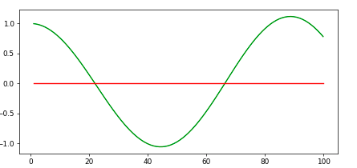

First I used a P Controler to adjust the value of the car to meet the reference value/minimize cte, However this caused the car to oscillate, The larger Kp value the faster oscillation of the car.
Kp = 1.0

Kp = 0.1

After some manual tuning I chose a value of 0.1 for Kp, However due to oscillation with turns & speed increases I had to decrease the throttol to 0.1 & add derivative gain Kd

Using Kd = 3.0 with Kp = 0.2

After some manual tuning I came into a value of 0.07 for Kd as the model was nearly stable beforhand due to lower speed